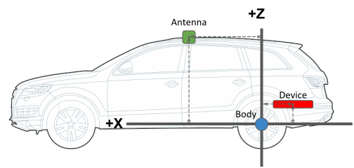
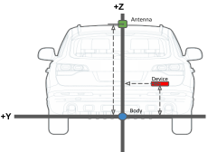

<br/>


# Point One FusionEngine Client

This library provides message definitions and support functionality for interacting with Point One FusionEngine in real
time, as well as processing recorded output data. Both C++ and Python are supported.

Click here to download the latest FusionEngine protocol specification PDF:
[Point One FusionEngine Message Specification](http://pointonenav.com/files/fusion-engine-message-spec)

See http://docs.pointonenav.com/fusion-engine/ for the latest C++ API documentation.

This library is released under the [MIT license agreement](LICENSE). We welcome code and documentation contributions
from users. See [Contributing](CONTRIBUTING.md) for instructions on how to report issues and develop, test, and submit
code changes.

If you encounter an issue, please [submit a ticket](CONTRIBUTING.md#reporting-issues). If you need support with Point
One FusionEngine or a Point One device (Atlas, Quectel LG69T, etc.), please contact support@pointonenav.com.

### Table Of Contents

* [Requirements](#requirements)
* [Directory Structure](#directory-structure)
  * [Example Applications](#example-applications)
* [Installation](#installation)
  * [CMake](#cmake)
    * [Compiling (Linux)](#compiling-linux)
    * [Compiling (Windows)](#compiling-windows)
    * [Running Examples](#running-examples-1)
  * [Bazel](#bazel)
    * [Compiling](#compiling)
    * [Running Examples](#running-examples)
  * [Python](#python)
  * [Compiling Documentation](#compiling-documentation)
* [Implementation Notes](#implementation-notes)
  * [Message Packing](#message-packing)
  * [Endianness](#endianness)
* [Usage](#usage)
  * [Body Coordinate Frame Definition](#body-coordinate-frame-definition)

### Requirements

#### C++ Support
- C++11 or later
- CMake 3.x or Bazel 3.x
- GCC, Clang, or Microsoft Visual Studio

#### Python Support
- Python 3.8 or later

#### Documentation Build Support (Optional)
- [Doxygen](https://www.doxygen.nl/) version 1.8.18
  - Versions 1.8.19 and 1.8.20 have a known issue with `enum` documentation and do not currently work

### Directory Structure

- `<root>` - Top-level Bazel and CMake build files (C++)
  - `examples/` - C++ example applications
  - `python/` - Python source files
    - `bin/` - Analysis and processing tools
    - `examples/` - Python example applications
    - `fusion_engine_client` - Top Python package directory
      - `messages` - Python message definitions
      - `parsers` - Message encoding and decoding support
  - `src/` - C++ source files
    - `point_one/`
      - `fusion_engine/`
        - `messages/` - C++ message definitions

#### Example Applications

The `examples/` directory contains example applications demonstrating how to use this library. They are:
- `message_decode` - Print the contents of messages contained in a binary file.
- `generate_data` - Generate a binary file containing a fixed set of messages.

## Installation

### CMake

#### Compiling (Linux)

Use the following steps to compile and install this library using CMake:

```
mkdir build
cd build
cmake ..
make
sudo make install
```

This will generate `libfusion_engine_client.so`, and install the library and header files on your system. By default,
this will also build the [example applications](#examples).

#### Compiling (Windows)

Use the following steps to compile and install this library using CMake and MSBuild:

```
mkdir output
cd output
cmake ..
MSBuild p1_fusion_engine_client.sln
```

> Note: For Windows, we name the build directory `output`. Windows is not case-sensitive, and `build` conflicts with the
> Bazel `BUILD` file.

#### Running Examples

By default, the compiled example applications will be located in `build/examples/` and can be run from there:

```
./build/examples/message_decode/message_decode
```

### Bazel

#### Compiling

To use this library in an existing Bazel project, add the following to your project's `WORKSPACE` file:

```python
git_repository(
    name = "fusion_engine_client",
    branch = "master",
    remote = "git@github.com:PointOneNav/fusion_engine_client.git",
)
```

Then add the following dependency to any `cc_library()` or `cc_binary()` definitions in your project:

```python
cc_library(
    name = "my_library",
    deps = [
        "@fusion_engine_client",
    ],
)
```

If desired, you can add a dependency for only part of the library. For example, to depend on only the core message
definitions and support code, set your `deps` entry to `@fusion_engine_client//:core`.

Note that there is no need to explicitly compile or link this library when using Bazel - it will be built automatically
when your application is built. If desired, however, you can build a stand-alone shared library as follows:

```
bazel build -c opt //:libfusion_engine_client.so
```

The generated file will be located at `bazel-bin/libfusion_engine_client.so`.

#### Running Examples

> Note: The `/examples` directory has been structured like a stand-alone Bazel project to illustrate how to integrate
> this library into your own project. The `bazel-bin/` directory below refers to `<root>/examples/bazel-bin/`.

To build all example applications, navigate to the `examples/` directory and run the following:

```
bazel build -c opt //:*
```

Alternatively, you can build individual applications as follows:

```
bazel build -c opt //message_decode
```

The generated applications will be located in `bazel-bin/`. For example:

```
bazel-bin/message_decode/message_decode message_decode/example_data.p1log
```

You can also use the `bazel run` command to build and run an application in one step:

```
bazel run -c opt //message_decode -- message_decode/example_data.p1log
```

### Python

See [Point One FusionEngine Python Client](python) for complete details and usage examples.

#### Install From PyPI

1. Install Python 3.8 (or later) and pip.
2. Install the `fusione-engine-client` module, including all analysis and data processing tools:
   ```bash
   python3 -m pip install fusion-engine-client[all]
   ```
   - Note: If you wish to only install data parsing support, and do not want to install plotting and other requirements
     used by the analysis tools in `bin/`, you may omit `[all]` and run `python3 -m pip install fusion-engine-client`
3. Run any of the applications in `bin/`. For example, to plot results from a `*.p1log` file from a Point One device:
   ```bash
   p1_display /path/to/log/file_or_directory
   ```

#### Install From Source (Development)

1. Install Python 3.8 (or later) and pip.
2. Clone a copy of this repository:
   ```bash
   git clone https://github.com/PointOneNav/fusion-engine-client.git
   ```
3. Install the Python requirements:
   ```bash
   python3 -m pip install -r requirements.txt
   ```
4. Run any of the applications in `bin/` or the example code in `examples/`. For example, to plot results from a
   `*.p1log` file from a Point One device:
   ```bash
   python3 bin/p1_display /path/to/log/file_or_directory
   ```

### Compiling Documentation

The documentation for the latest release is generated automatically and hosted at
http://docs.pointonenav.com/fusion-engine/. If you would like to build documentation locally, simply run `doxygen` from
the repository root directory. The generated output will be located in `docs/html/`. To view it, open
`docs/html/index.html` in a web browser.

## Implementation Notes

### Message Packing

The canonical definitions for the FusionEngine messages are their C++ struct definitions. These definitions are given
the attributes:
 * `packed` - This attribute sets that no implicit padding should be inserted between members of the struct. For example:
   ```
   struct Foo {
     uint8_t a;
     uint64_t b;
   };
   ```
   Without the `packed` attribute, the size of `Foo` could be 12 or 16 bytes with 3 or 7 bytes of padding inserted
   between the members `a` and `b`. With `packed`, the two member variables will be back-to-back in memory.
 * `aligned(4)` - This attribute ensures that the the size of the struct will be padded at the end to be a multiple of 4
   bytes. It also makes the default alignment of the struct in memory 4 bytes as well.

In addition to these struct attributes, the struct definitions manually enforce 4 byte alignment for floating point values (i.e., `float` and `double`).

### Endianness

Generally, functions in this library assume that serialized data is little-endian.

No special detection of conversion is done to enforce this, so external handling would be needed to use this library with a big-endian system.

## Usage

All FusionEngine messages contain a `MessageHeader` followed by the payload of the specific message. To decode an
incoming message you must:

1. Deserialize the header.
2. Validate the message by checking the CRC (optional).
3. Deserialize the payload indicated by the `message_type` field in the header.

For example:

```c++
#include <point_one/fusion_engine/messages/core.h>

using namespace point_one::fusion_engine::messages;

void DeserializeMessage(const uint8_t* buffer) {
  const MessageHeader& header = *reinterpret_cast<const MessageHeader*>(buffer);
  if (header.message_type == MessageType::POSE) {
    const PoseMessage& contents =
        *reinterpret_cast<const PoseMessage*>(buffer + sizeof(MessageHeader));
    ...
  }
}
```

See the `message_decode` example for more details.

### Body Coordinate Frame Definition

 

The platform body axes are defined as +x forward, +y left, and +z up. A positive yaw is a left turn, positive pitch
points the nose of the vehicle down, and positive roll is a roll toward the right. Yaw is measured from east in a
counter-clockwise direction. For example, north is +90 degrees (i.e., `heading = 90.0 - yaw`).
